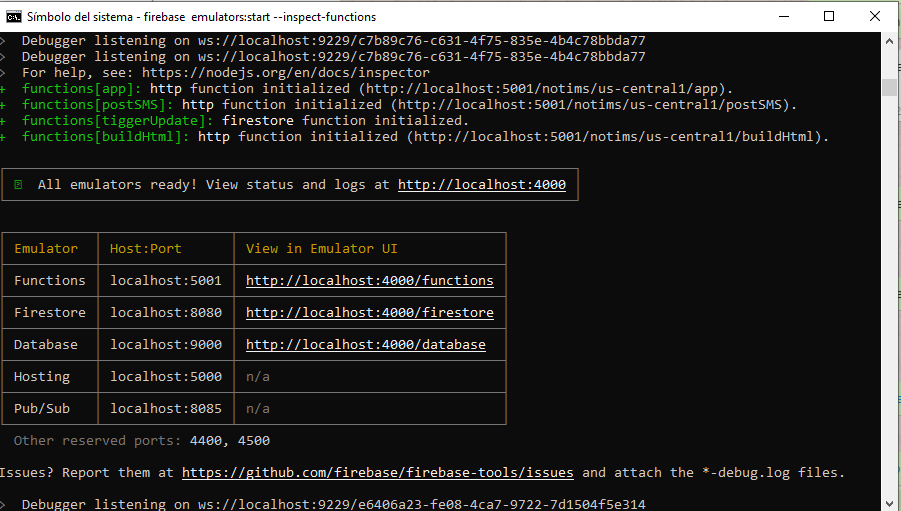

<p align="center">
  
</p>             
               
# Curupas

Mobile project with Flutter and Firebase, this guide was created for Ubuntu Linux but can be useful for Windows and Mac.

# Setup Firebase CLI reference and install local environment

https://firebase.google.com/docs/cli

Install Node

https://nodejs.org/ 

Install Cli for Windows stand alone or run npm command

```sh
npm install -g firebase-tools
```

# Login

In order to link a local account with a firebase account, you must initialize firebase while an active project is on the web, choose it. 

```sh
firebase login
```

## Functions (firebase backend endpoints)

To initialize the functions it is necessary to clone the branch 'functions' and install the firebase command line following [this guide] (https://firebase.google.com/docs/functions/local-emulator) and run the command.

```
git clone git@gitlab.com:JoseVigil/curupa.git
```

To checkout the **functions** branch when not found

```sh
git clone git@gitlab.com:JoseVigil/curupa.git
cd curupa
git remote update
git fetch 
git checkout --track origin/<BRANCH-NAME> 
```

Init commands
-------------

```sh
firebase init
```

Follow the wizard and aswer accordingly.

| Module  | Initialization | Response | 
| ---     |  ------  |---------:|
| Project | Which Firebase CLI features do you want to set up for this folder? Press Space to select features, then Enter to confirm your choices.  | Select all   |
| Database | What file should be used for Database Rules?  | ENTER (database.rules.json) |
| Database | File database.rules.json already exists. Do you want to overwrite it with the Database Rules for  from the Firebase Console?  | ENTER (N)  |
| Firestore |  What file should be used for Firestore Rules?  | ENTER (firestore.rules) |
| Firestore | File firestore.rules already exists. Do you want to overwrite it with the Firestore Rules from the Firebase Console?  | ENTER (N) |
| Firestore |  What file should be used for Firestore indexes?  | ENTER (firestore.indexes.json) |
| Firestore | File firestore.indexes.json already exists. Do you want to overwrite it with the Firestore Indexes from the Firebase Console?  | ENTER (N) |
| Functions | What language would you like to use to write Cloud Functions? | Javascript |
| Functions | Do you want to use ESLint to catch probable bugs and enforce style?  | Y |
| Functions | File functions/package.json already exists. Overwrite?  | ENTER (N) |
| Functions | File functions/index.js already exists. Overwrite?  | ENTER (N) |
| Functions | File functions/.gitignore already exists. Overwrite?  | ENTER (N) |
| Functions | Do you want to install dependencies with npm now?  | ENTER (Y) |
| Hosting |  What do you want to use as your public directory?  | ENTER (public) |
| Hosting |  Configure as a single-page app (rewrite all urls to /index.html)?  | ENTER (N) |
| Hosting |  File public/404.html already exists. Overwrite?  | ENTER (N) |
| Hosting |  File public/index.html already exists. Overwrite?  | ENTER (N) |
| Storage | What file should be used for Storage Rules?  | ENTER (storage.rules) |
| Emulators | Which Firebase emulators do you want to set up? Press Space to select emulators, then Enter to confirm your choices.  | Select All |
| Emulators | Which port do you want to use for the hosting emulator? | ENTER (5000) |
| Emulators | Would you like to download the emulators now? | Y |

To run Visual Studio Code with root access command

```sh
sudo code --user-data-dir="~/.vscode-root"
```

In case skipped installing repos run install into functions and functions/functions
```sh
npm install
```

Emulators
---------

Install tools

```sh
npm install -g firebase-tools

npm i -D @firebase/testing

firebase setup:emulators:firestore
```

Edit firebase.json and add the emulators

```sh
"emulators": {
    "functions": {
      "port": 5001
    },
    "firestore": {
      "port": 8080
    },
    "database": {
      "port": 9000
    },
    "hosting": {
      "port": 5000
    },
    "pubsub": {
      "port": 8085
    },
    "ui": {
      "enabled": true
    }
  },
```

Emulators should be downloaded

**Start emulators**

```sh
sudo firebase emulators:start

```

<p align="center">
  
</p>  

If the port is busy, start with this command or change the port number above

```sh
"firestore": {
   port": 5003
},
```

```sh
sudo firebase serve
```

Deploy (only Jose)

```sh
sudo firebase deploy
```

Local port test 

curl -X POST -H "Content-Type: application/json"  -d '{"data":{"name":"YOUR_NAME"}}'  http://localhost:5000/curupa-d830b/us-central1/helloWorld


Bug
---

The fancy_bottom_navigation flutter component https://pub.dev/packages/fancy_bottom_navigation is limited to 4 tabs. In order to extend it to 5 wich the project uses please comment this line 28 of fancy_button_navigation.dat file.

```sh
  assert(tabs.length > 1 && tabs.length < 7);
```

## Flutter start project form scratch

Create a new flutter project

```sh
flutter create --androidx --org com.curupayti curupas
```

Notice the final package name is com.curupayti.curupas. If the project already existed migrate lib folder by creating the folders manually and moving the files also manually. 

## Firebase 

Creado en base a la cuenta curupasapp@gmail.com

# Create new project

Create new project.

Enable database and storage, allow permission on both rules for testing. Read write true.

# Initialize SDK

In order to use firestore on functions you need to initilize the app with "Firebase Admin SDK" certificate 

Settings -> Service Account -> Firebase Admin SDK -> Node.js

Keep generated json

# Enable Authentication

Go to Authentication -> Signe-in methods -> Enable email and facebook

# Facebook login

Facebook Developers https://developers.facebook.com/apps/911713599192029 Curupas App

AppId: 911713599192029 
App Secret: 9d176aecb3e71f48479a16990faddb94

URI: https://curupas-app.firebaseapp.com/__/auth/handler

Product -> Facebook Login -> Valid OAuth Redirect URIs -> Pegar URI

**Add Application iOS and Android**

Package name: com.curupayti.curupas


